Data set
========

Data set
--------

El data set <b class = "miNota" > forestfires.csv </b> proviene de <https://archive.ics.uci.edu/ml/datasets.html>

-   Parque natural Montesinho, en la región noreste de Portugal Trás-os-Montes

-   Los datos se recolectaron de enero del 2000 a diciembre del 2003

-   517 observaciones

Montesinho
----------

| Atributo |                    Descripción                   |
|:--------:|:------------------------------------------------:|
|   \(X\)  |      Coordenada en el eje \(x\) (del 1 al 9)     |
|   \(Y\)  |      Coordenada en el eje \(y\) (del 1 al 9)     |
|   month  |        Mes del año (de enero a diciembre )       |
|    day   | Día de la semana (de lunes a domingo, en ingles) |
|   FFMC   |                    Código FFMC                   |
|    DMC   |                    Código DMC                    |
|    DC    |                     Código DC                    |
|    ISI   |                    Indice ISI                    |

| Atributo |               Descripción               |
|:--------:|:---------------------------------------:|
|   temp   |    Temperatura exterior (en \(^0\)C)    |
|    RH    |         Humedad relativa (en %)         |
|   wind   | Velocidad del viento exterior (en km/h) |
|   rain   |  Lluvia en el exterior (en mm/m\(^2\))  |
|   area   |       Total de área quemada (en )       |

    ## 
    ## Attaching package: 'reshape'

    ## The following objects are masked from 'package:plyr':
    ## 
    ##     rename, round_any

    FALSE `stat_bin()` using `bins = 30`. Pick better value with `binwidth`.

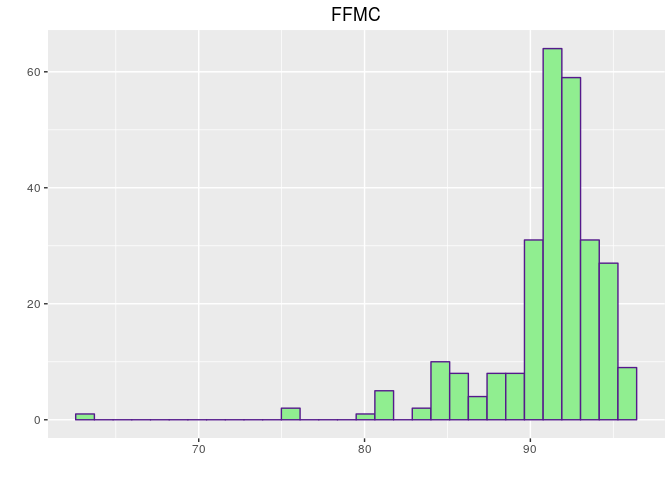

    ## `stat_bin()` using `bins = 30`. Pick better value with `binwidth`.

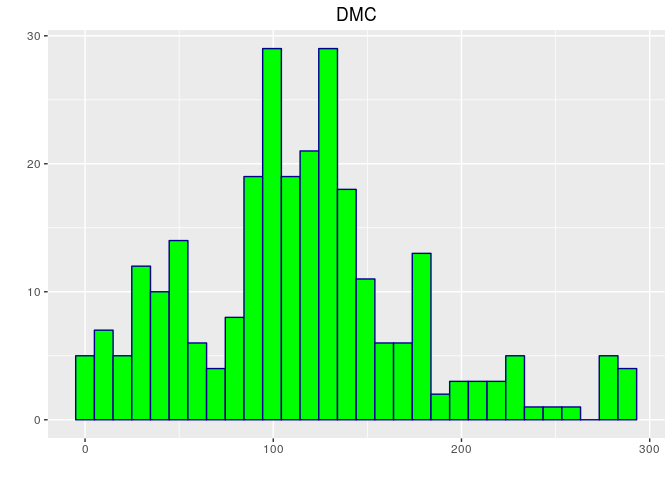

    ## `stat_bin()` using `bins = 30`. Pick better value with `binwidth`.

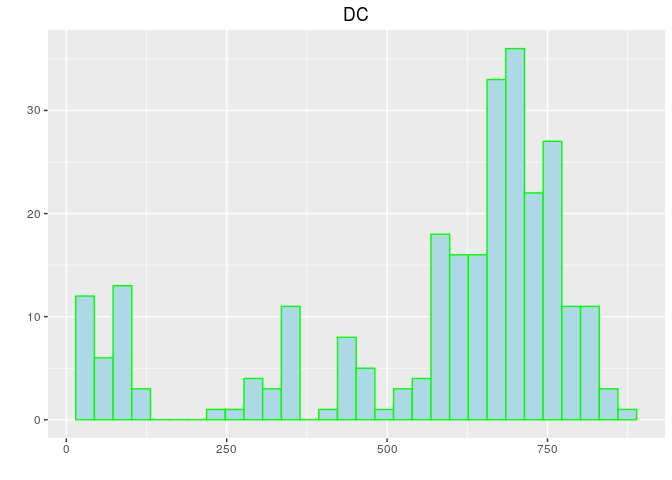

    ## `stat_bin()` using `bins = 30`. Pick better value with `binwidth`.

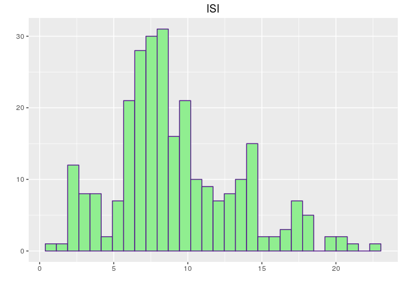

    ## `stat_bin()` using `bins = 30`. Pick better value with `binwidth`.

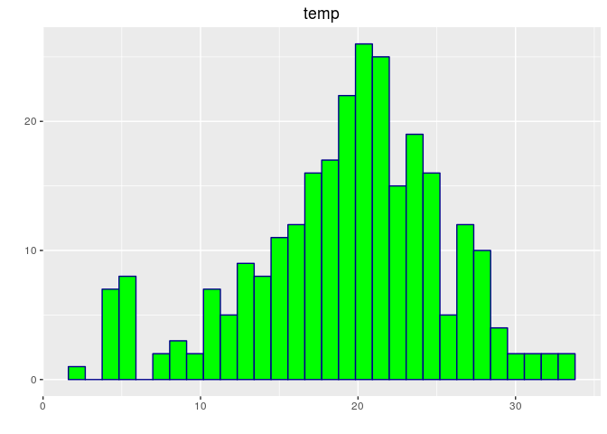

    ## `stat_bin()` using `bins = 30`. Pick better value with `binwidth`.

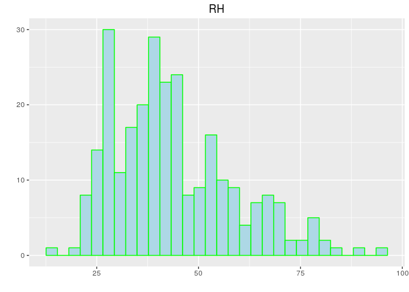

    ## `stat_bin()` using `bins = 30`. Pick better value with `binwidth`.

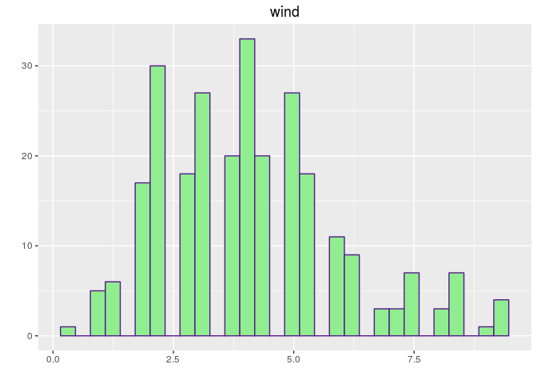

    ## `stat_bin()` using `bins = 30`. Pick better value with `binwidth`.

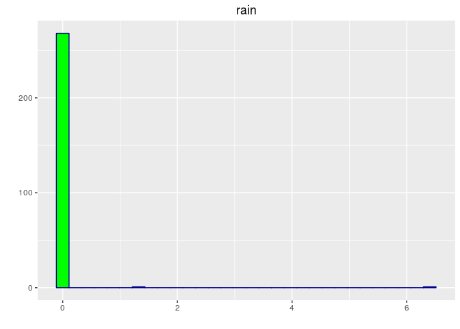

    ## `stat_bin()` using `bins = 30`. Pick better value with `binwidth`.

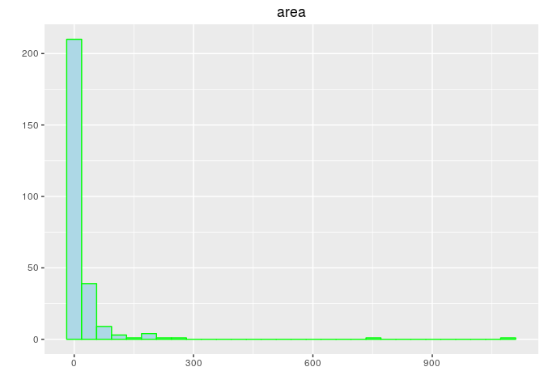

    ## 
      |                                                                       
      |                                                                 |   0%

    ## 
      |                                                                       
      |                                                                 |   1%
      |                                                                       
      |=                                                                |   1%
      |                                                                       
      |=                                                                |   2%
      |                                                                       
      |==                                                               |   2%
      |                                                                       
      |==                                                               |   3%
      |                                                                       
      |==                                                               |   4%
      |                                                                       
      |===                                                              |   4%
      |                                                                       
      |===                                                              |   5%
      |                                                                       
      |====                                                             |   5%
      |                                                                       
      |====                                                             |   6%
      |                                                                       
      |====                                                             |   7%
      |                                                                       
      |=====                                                            |   7%
      |                                                                       
      |=====                                                            |   8%
      |                                                                       
      |======                                                           |   9%
      |                                                                       
      |======                                                           |  10%
      |                                                                       
      |=======                                                          |  10%
      |                                                                       
      |=======                                                          |  11%
      |                                                                       
      |========                                                         |  12%
      |                                                                       
      |========                                                         |  13%
      |                                                                       
      |=========                                                        |  13%
      |                                                                       
      |=========                                                        |  14%
      |                                                                       
      |=========                                                        |  15%
      |                                                                       
      |==========                                                       |  15%
      |                                                                       
      |==========                                                       |  16%
      |                                                                       
      |===========                                                      |  16%
      |                                                                       
      |===========                                                      |  17%
      |                                                                       
      |===========                                                      |  18%
      |                                                                       
      |============                                                     |  18%
      |                                                                       
      |============                                                     |  19%
      |                                                                       
      |=============                                                    |  19%
      |                                                                       
      |=============                                                    |  20%
      |                                                                       
      |=============                                                    |  21%
      |                                                                       
      |==============                                                   |  21%
      |                                                                       
      |==============                                                   |  22%
      |                                                                       
      |===============                                                  |  22%
      |                                                                       
      |===============                                                  |  23%
      |                                                                       
      |===============                                                  |  24%
      |                                                                       
      |================                                                 |  24%
      |                                                                       
      |================                                                 |  25%
      |                                                                       
      |=================                                                |  25%
      |                                                                       
      |=================                                                |  26%
      |                                                                       
      |=================                                                |  27%
      |                                                                       
      |==================                                               |  27%
      |                                                                       
      |==================                                               |  28%
      |                                                                       
      |===================                                              |  29%
      |                                                                       
      |===================                                              |  30%
      |                                                                       
      |====================                                             |  30%
      |                                                                       
      |====================                                             |  31%
      |                                                                       
      |=====================                                            |  32%
      |                                                                       
      |=====================                                            |  33%
      |                                                                       
      |======================                                           |  33%
      |                                                                       
      |======================                                           |  34%
      |                                                                       
      |======================                                           |  35%
      |                                                                       
      |=======================                                          |  35%
      |                                                                       
      |=======================                                          |  36%
      |                                                                       
      |========================                                         |  36%
      |                                                                       
      |========================                                         |  37%
      |                                                                       
      |========================                                         |  38%
      |                                                                       
      |=========================                                        |  38%
      |                                                                       
      |=========================                                        |  39%
      |                                                                       
      |==========================                                       |  39%
      |                                                                       
      |==========================                                       |  40%
      |                                                                       
      |==========================                                       |  41%
      |                                                                       
      |===========================                                      |  41%
      |                                                                       
      |===========================                                      |  42%
      |                                                                       
      |============================                                     |  42%
      |                                                                       
      |============================                                     |  43%
      |                                                                       
      |============================                                     |  44%
      |                                                                       
      |=============================                                    |  44%
      |                                                                       
      |=============================                                    |  45%
      |                                                                       
      |==============================                                   |  45%
      |                                                                       
      |==============================                                   |  46%
      |                                                                       
      |==============================                                   |  47%
      |                                                                       
      |===============================                                  |  47%
      |                                                                       
      |===============================                                  |  48%
      |                                                                       
      |================================                                 |  49%
      |                                                                       
      |================================                                 |  50%
      |                                                                       
      |=================================                                |  50%
      |                                                                       
      |=================================                                |  51%
      |                                                                       
      |==================================                               |  52%
      |                                                                       
      |==================================                               |  53%
      |                                                                       
      |===================================                              |  53%
      |                                                                       
      |===================================                              |  54%
      |                                                                       
      |===================================                              |  55%
      |                                                                       
      |====================================                             |  55%
      |                                                                       
      |====================================                             |  56%
      |                                                                       
      |=====================================                            |  56%
      |                                                                       
      |=====================================                            |  57%
      |                                                                       
      |=====================================                            |  58%
      |                                                                       
      |======================================                           |  58%
      |                                                                       
      |======================================                           |  59%
      |                                                                       
      |=======================================                          |  59%
      |                                                                       
      |=======================================                          |  60%
      |                                                                       
      |=======================================                          |  61%
      |                                                                       
      |========================================                         |  61%
      |                                                                       
      |========================================                         |  62%
      |                                                                       
      |=========================================                        |  62%
      |                                                                       
      |=========================================                        |  63%
      |                                                                       
      |=========================================                        |  64%
      |                                                                       
      |==========================================                       |  64%
      |                                                                       
      |==========================================                       |  65%
      |                                                                       
      |===========================================                      |  65%
      |                                                                       
      |===========================================                      |  66%
      |                                                                       
      |===========================================                      |  67%
      |                                                                       
      |============================================                     |  67%
      |                                                                       
      |============================================                     |  68%
      |                                                                       
      |=============================================                    |  69%
      |                                                                       
      |=============================================                    |  70%
      |                                                                       
      |==============================================                   |  70%
      |                                                                       
      |==============================================                   |  71%
      |                                                                       
      |===============================================                  |  72%
      |                                                                       
      |===============================================                  |  73%
      |                                                                       
      |================================================                 |  73%
      |                                                                       
      |================================================                 |  74%
      |                                                                       
      |================================================                 |  75%
      |                                                                       
      |=================================================                |  75%
      |                                                                       
      |=================================================                |  76%
      |                                                                       
      |==================================================               |  76%
      |                                                                       
      |==================================================               |  77%
      |                                                                       
      |==================================================               |  78%
      |                                                                       
      |===================================================              |  78%
      |                                                                       
      |===================================================              |  79%
      |                                                                       
      |====================================================             |  79%
      |                                                                       
      |====================================================             |  80%
      |                                                                       
      |====================================================             |  81%
      |                                                                       
      |=====================================================            |  81%
      |                                                                       
      |=====================================================            |  82%
      |                                                                       
      |======================================================           |  82%
      |                                                                       
      |======================================================           |  83%
      |                                                                       
      |======================================================           |  84%
      |                                                                       
      |=======================================================          |  84%
      |                                                                       
      |=======================================================          |  85%
      |                                                                       
      |========================================================         |  85%
      |                                                                       
      |========================================================         |  86%
      |                                                                       
      |========================================================         |  87%
      |                                                                       
      |=========================================================        |  87%
      |                                                                       
      |=========================================================        |  88%
      |                                                                       
      |==========================================================       |  89%
      |                                                                       
      |==========================================================       |  90%
      |                                                                       
      |===========================================================      |  90%
      |                                                                       
      |===========================================================      |  91%
      |                                                                       
      |============================================================     |  92%
      |                                                                       
      |============================================================     |  93%
      |                                                                       
      |=============================================================    |  93%
      |                                                                       
      |=============================================================    |  94%
      |                                                                       
      |=============================================================    |  95%
      |                                                                       
      |==============================================================   |  95%
      |                                                                       
      |==============================================================   |  96%
      |                                                                       
      |===============================================================  |  96%
      |                                                                       
      |===============================================================  |  97%
      |                                                                       
      |===============================================================  |  98%
      |                                                                       
      |================================================================ |  98%
      |                                                                       
      |================================================================ |  99%
      |                                                                       
      |=================================================================|  99%
      |                                                                       
      |=================================================================| 100%

    ## 
    ## Call:
    ## lm(formula = area ~ monthapr + monthaug + monthdec + monthfeb + 
    ##     monthjul + monthjun + monthmar + monthmay + monthoct + monthsep + 
    ##     daymon + daysat + daysun + daythu + daytue + daywed + FFMC + 
    ##     DMC + DC + ISI + temp + RH + wind + rain - 1, data = train.cv)
    ## 
    ## Coefficients:
    ##     monthapr      monthaug      monthdec      monthfeb      monthjul  
    ##  0.022741688   0.071360226   0.039150678   0.005796617   0.062959801  
    ##     monthjun      monthmar      monthmay      monthoct      monthsep  
    ##  0.032719946   0.006493146   0.038706834   0.090261489   0.091903062  
    ##       daymon        daysat        daysun        daythu        daytue  
    ##  0.010654176   0.014456479   0.008711164  -0.001972369   0.013789356  
    ##       daywed          FFMC           DMC            DC           ISI  
    ##  0.004597495   0.002123276   0.037062432  -0.108957936  -0.022039931  
    ##         temp            RH          wind          rain  
    ##  0.004853051  -0.006659669   0.009968506  -0.006236638

    ## [1] 25327.29235

Preprocesamiento
================

    ## `stat_bin()` using `bins = 30`. Pick better value with `binwidth`.

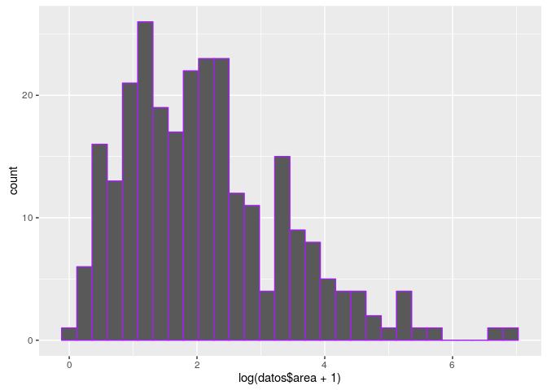

    ## [1] 25327.29235

Encoding <b class = "miNota" > comodo </b> y <b class = "miNota" > útil </b> en \(t\) y \(\Omega\)

-   \((X,Y)\) vs \(\{X\}\) y \(\{X\}\) <b class = "miNota" > :( </b>

-   \(month\) y \(day\) <b class = "miNota" > :D </b>

Diseño NN
=========

Training y test
===============

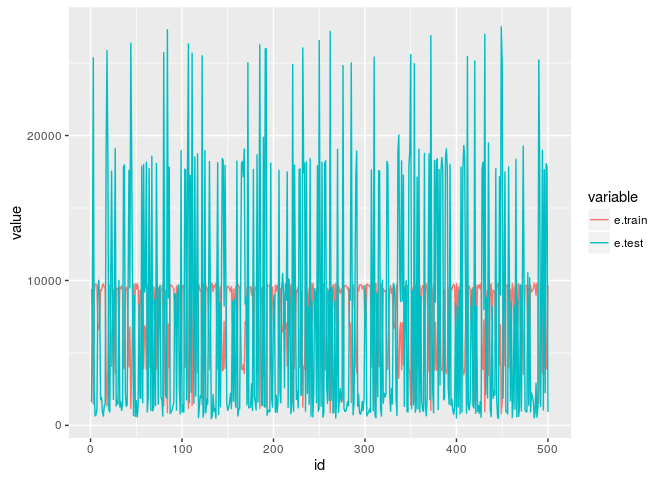

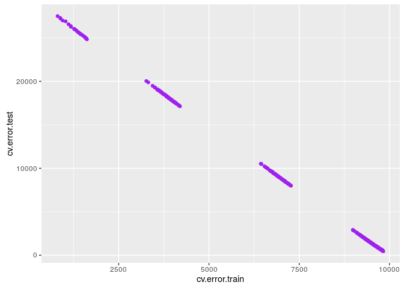

Conclusión
----------

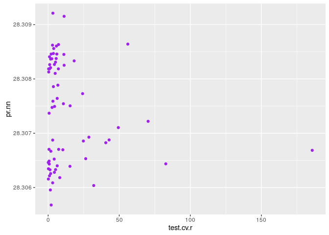

    ## [1] 7259.591524

hist(test.cv.r - pr.nn )
