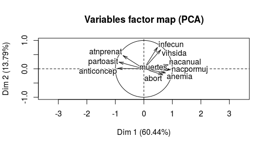
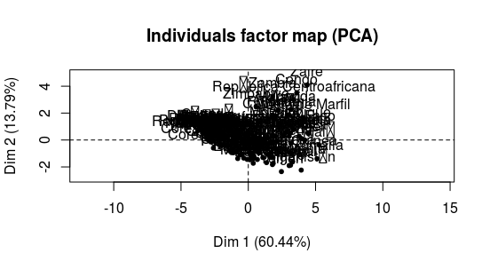

---
header-includes:
- \usepackage[utf8]{inputenc}
- \usepackage{verbatim}
- \usepackage{graphicx}
- \usepackage[spanish]{babel}
- \usepackage{amsfonts}
- \usepackage[table,xcdraw]{xcolor}
- \usepackage{enumitem}
- \usepackage{listings}
- \usepackage{geometry}
- \usepackage{setspace}

output:
  md_document:
    variant: markdown_github
---

\begin{titlepage}
\begin{center}
\vspace*{-1in}

\begin{figure}[htb]
\centering
\includegraphics[ width = 8cm ]{fesa.png}
\end{figure}
\vspace*{0.25in}
\large{Universidad Nacional Autónoma de México}\\
\vspace*{0.5in}
Facultad de Estudios Superiores Acatlán\\
\vspace*{0.5in}
Técnicas estadísticas y minería de datos\\
\vspace*{0.5in}
Módulo VI. Análisis de varianza, factorial y de correspondencias y técnicas de estadística multivariada \\
\vspace*{0.5in}
\begin{large}
Practica 2: \\
\end{large}
\vspace*{0.2in}
\begin{Large}
\textbf{Factores de riesgo en aborto usando PCA} \\
\end{Large}
\vspace*{0.5in}
Camacho Ortíz Yuly \\
García Ramírez José Antonio \\
Méndez Ramírez Kenny Yahir \\
Vera Luna Maximiliano \\ 
%\end{itemize}
%\end{large}
\vspace*{1in}
Septiembre 2016 \\
\vspace*{0.05in}
\rule{80mm}{0.1mm}\\
\vspace*{0.1in}
\begin{Large}

\end{Large}
\end{center}

\end{titlepage}

\newpage 
\tableofcontents{}
 \newpage
 
```{r setup, include=FALSE, echo = FALSE}
knitr::opts_chunk$set(echo = TRUE)
library(ggplot2)
library(xtable)
rowData <- read.csv("/home/fou/Desktop/Modernidad/diplomado/Multivariado2/Practica 2/riesgo2.csv")
head(rowData)
Riesgo <- rowData$calif
rowData$calif <- NULL
cols <- colnames(rowData)
Data <- rowData[, cols[-1]]
rownames(Data) <- rowData$pais
head(Data)
S <- cov(Data)
R <- cor(Data)
```


## Objetivo

El objetivo principal de esta práctica consiste en construir desde la definición de valores y vectores propios las componentes principales de un conjunto de datos provenientes del rubro de salud.

## Teoría

El análisis de componentes principales, o PCA por sus siglas en inglés, es una técnica demasiado popular en la actualidad pues incluso algunos cursos online cubren el método y su implementación en diversos lenguajes de cómputo \footnote{Por ejemplo Distributed Machine Learning with Apache Spark en la plataforma EDX}. Si bien se puede caer en confusión entre PCA y el análisis factorial y usar los resultados del primero sin los supuestos necesarios del segundo, PCA ofrece una reducción de dimensión que permite una visualización de datos suficiente y en términos de pruebas al probar modelos resultan útiles las variables independientes que ofrece. 


## Análisis estadístico


### S y R

Al calcular las matrices de varianza-covarianza y de correlaciones (las cuales mostramos en los siguientes cuadros)  notamos que entre algunas variables la covarianza es alta como por ejemplo el número de muertes y el nivel de VIH, esto aunado al hecho de que las variables se miden en diferentes unidades nos decide a utilizar la matriz de correlaciones para PCA.


Matriz de varianza-covarianzas: 
\begin{table}[ht]
\centering
\begin{tabular}{rrrrrrrrr}
  \hline
S & nacanual & anticoncep & abort & anemia & atnprenat & partoasit & vihsida & infecun \\ 
  \hline
nacanual & 41.62 & -130.87 & 5.26 & 62.09 & -96.50 & -123.32 & 2.40 & 11.19 \\ 
  anticoncep & -130.87 & 736.85 & -22.80 & -319.30 & 446.53 & 621.30 & -9.35 & -38.53 \\ 
  abort & 5.26 & -22.80 & 2.21 & 13.16 & -16.67 & -24.62 & 0.29 & 0.69 \\ 
  anemia & 62.09 & -319.30 & 13.16 & 326.39 & -252.03 & -354.12 & 4.97 & 14.20 \\ 
  atnprenat & -96.50 & 446.53 & -16.67 & -252.03 & 698.20 & 618.24 & -1.91 & -10.16 \\ 
  partoasit & -123.32 & 621.30 & -24.62 & -354.12 & 618.24 & 902.64 & -8.12 & -28.64 \\ 
  vihsida & 2.40 & -9.35 & 0.29 & 4.97 & -1.91 & -8.12 & 0.48 & 1.57 \\ 
  infecun & 11.19 & -38.53 & 0.69 & 14.20 & -10.16 & -28.64 & 1.57 & 12.68 \\ 
  nacpormuj & 10.34 & -51.49 & 1.86 & 24.30 & -33.88 & -47.66 & 0.74 & 2.62 \\ 
  muertes & 1468.03 & -6344.75 & 224.55 & 3651.03 & -5718.50 & -7252.06 & 99.25 & 455.55 \\ 
   \hline
\end{tabular}
\end{table}
\begin{table}[ht]
\centering
\begin{tabular}{rrr}
  \hline
 S & nacpormuj & muertes \\ 
  \hline
nacanual & 10.34 & 1468.03 \\ 
  anticoncep & -51.49 & -6344.75 \\ 
  abort & 1.86 & 224.55 \\ 
  anemia & 24.30 & 3651.03 \\ 
  atnprenat & -33.88 & -5718.50 \\ 
  partoasit & -47.66 & -7252.06 \\ 
  vihsida & 0.74 & 99.25 \\ 
  infecun & 2.62 & 455.55 \\ 
  nacpormuj & 4.05 & 459.69 \\ 
  muertes & 459.69 & 104712.98 \\ 
   \hline
\end{tabular}
\end{table}

En particular las entradas de la matriz de correlaciones son significativas, digamos en valor absoluto son mayores a 0.3 aunque sería conveniente una prueba de significancia de correlación extendida a matrices.

\begin{table}[ht]
\centering
\begin{tabular}{rrrrrrrrr}
  \hline
R & nacanual & anticoncep & abort & anemia & atnprenat & partoasit & vihsida & infecun \\ 
  \hline
nacanual & 1.00 & -0.75 & 0.55 & 0.53 & -0.57 & -0.64 & 0.54 & 0.49 \\ 
  anticoncep & -0.75 & 1.00 & -0.56 & -0.65 & 0.62 & 0.76 & -0.50 & -0.40 \\ 
  abort & 0.55 & -0.56 & 1.00 & 0.49 & -0.42 & -0.55 & 0.29 & 0.13 \\ 
  anemia & 0.53 & -0.65 & 0.49 & 1.00 & -0.53 & -0.65 & 0.40 & 0.22 \\ 
  atnprenat & -0.57 & 0.62 & -0.42 & -0.53 & 1.00 & 0.78 & -0.10 & -0.11 \\ 
  partoasit & -0.64 & 0.76 & -0.55 & -0.65 & 0.78 & 1.00 & -0.39 & -0.27 \\ 
  vihsida & 0.54 & -0.50 & 0.29 & 0.40 & -0.10 & -0.39 & 1.00 & 0.63 \\ 
  infecun & 0.49 & -0.40 & 0.13 & 0.22 & -0.11 & -0.27 & 0.63 & 1.00 \\ 
  nacpormuj & 0.80 & -0.94 & 0.62 & 0.67 & -0.64 & -0.79 & 0.53 & 0.37 \\ 
  muertes & 0.70 & -0.72 & 0.47 & 0.62 & -0.67 & -0.75 & 0.44 & 0.40 \\ 
   \hline
\end{tabular}
\end{table}
\begin{table}[ht]
\centering
\begin{tabular}{rrr}
  \hline
 R & nacpormuj & muertes \\ 
  \hline
nacanual & 0.80 & 0.70 \\ 
  anticoncep & -0.94 & -0.72 \\ 
  abort & 0.62 & 0.47 \\ 
  anemia & 0.67 & 0.62 \\ 
  atnprenat & -0.64 & -0.67 \\ 
  partoasit & -0.79 & -0.75 \\ 
  vihsida & 0.53 & 0.44 \\ 
  infecun & 0.37 & 0.40 \\ 
  nacpormuj & 1.00 & 0.71 \\ 
  muertes & 0.71 & 1.00 \\ 
   \hline
\end{tabular}
\end{table}

### Eigen
Las diez componentes principales de los datos son las siguientes:

```{r, echo = FALSE}
Aleman <- eigen(R)
EigenValues <- Aleman$values
EigenVectors <- Aleman$vectors 

```

$PC_1=
0.35*nacanual + -0.37*anticoncep + 0.27*abort + 0.31*anemia + -0.3*atnprenat + -0.35*partoasit + 0.24*vihsida + 0.19*infecun + 0.38*nacpormuj + 0.35*muertes$

$PC_2=-0.12*nacanual + -0.01*anticoncep + 0.18*abort + 0.12*anemia + -0.4*atnprenat + -0.2*partoasit + -0.57*vihsida + -0.64*infecun + 0.03*nacpormuj + 0.04*muertes$

$PC_3=0.02*nacanual + -0.03*anticoncep + 0.76*abort + 0.11*anemia + 0.43*atnprenat + 0.17*partoasit + 0.16*vihsida + -0.25*infecun + 0.12*nacpormuj + -0.3*muertes$

$PC_4=
-0.36*nacanual + 0.03*anticoncep + -0.31*abort + 0.79*anemia + 0.18*atnprenat + -0.05*partoasit + 0.27*vihsida + -0.21*infecun + -0.05*nacpormuj + 0.02*muertes$

$PC_5=-0.12*nacanual + 0.48*anticoncep + 0.43*abort + 0.23*anemia + -0.13*atnprenat + -0.04*partoasit + -0.12*vihsida + 0.38*infecun + -0.47*nacpormuj + 0.34*muertes$


$PC_6=0.38*nacanual + -0.17*anticoncep + -0.1*abort + 0.4*anemia + 0.18*atnprenat + 0.49*partoasit + -0.57*vihsida + 0.23*infecun + 0.07*nacpormuj + 0.01*muertes$


$PC_7=-0.48*nacanual + -0.24*anticoncep + 0.1*abort + 0.09*anemia + -0.13*atnprenat + -0.25*partoasit + -0.25*vihsida + 0.49*infecun + 0.13*nacpormuj + -0.54*muertes$

$PC_8=-0.47*nacanual + -0.36*anticoncep + 0.06*abort + -0.21*anemia + 0.43*atnprenat + -0.01*partoasit + -0.21*vihsida + 0.03*infecun + 0.09*nacpormuj + 0.6*muertes$

$PC_9=-0.33*nacanual + -0.2*anticoncep + 0.11*abort + -0.02*anemia + -0.53*atnprenat + 0.7*partoasit + 0.25*vihsida + -0.01*infecun + 0.04*nacpormuj + 0.08*muertes$

$PC_{10}=-0.14*nacanual + 0.61*anticoncep + -0.03*abort + -0.01*anemia + 0.01*atnprenat + 0.08*partoasit + -0.07*vihsida + 0.07*infecun + 0.76*nacpormuj + 0.1*muertes$


Entre las aplicaciones de PCA se encuentra la de encontrar un espacio en el cual se pueden representar los datos de manera que se conserva la mayor cantidad de varianza de los mismos y con variables que son independientes. En esta sección graficamos las tres primeras componentes principales.


```{r, echo = FALSE}
PCA <- as.matrix(Data) %*% EigenVectors
PCA <- as.data.frame(PCA)
colnames(PCA) <- paste0(rep("PC", 10),1:10)

tema2 <- theme( panel.background = element_blank() ,
				panel.grid.major = element_line(colour = "black", linetype = "dotted"))
					
ggplot(PCA, aes(PC1,PC2)) + geom_point(colour = 'red4', size = 1)+ tema2 + ggtitle("Proyección PC1 vs PC2")

ggplot(PCA, aes(PC1,PC3)) + geom_point(colour = 'blue4', size = 1) +
	tema2 +ggtitle("Proyección PC1 vs PC3")


ggplot(PCA, aes(PC2,PC3)) + geom_point(colour = 'green4', size = 1) +
	tema2 + ggtitle("Proyección PC1 vs PC3")

```

### Varianzas

Es un resultado, dentro de la teoría de PCA, que los valores propios de la matriz que se ortogonaliza se corresponden con las varianzas de las componentes principales (al ser las componentes principales los valores propios de la descomposición espectral de la matriz) independientemente de la matriz que ortogonalizamos, \textbf{R} o \textbf{S}, y del método numérico. 

En general la suma de los valores propios de la matriz que se ortogonaliza es la varianza total de las componentes, la implementación de R (y todas las que conocemos) se restringen a buscar vectores propios en la hiperesfera de radio unitaria por lo que la suma de los valores propios (varianzas de las componentes) es igual al número de variables con el que estamos trabajando. 

```{r}
sum(EigenValues)
```

El siguiente gráfico muestra la cantidad de varianza que se retiene hasta la $n$-ésima componente.

```{r, echo = FALSE}
VarPC <- EigenValues / sum(EigenValues)  
qplot(1:10,cumsum(VarPC), geom = 'jitter', colour  = I("red4")) + tema2 +  ggtitle("Var exp. hasta la n-ésima comp.")

```

Decidimos quedarnos hasta la séptima componente porque explican el 95% y es apenas un 70% de la cantidad de datos originales. 

### Interpretación de las componentes
Las variables cuyos pesos son negativos en la primer componente son las siguientes:


```{r}
colnames(Data)[EigenVectors[,1]<0]


```

Por lo que podemos interpretar a la primer componente como una variable que refleja la situación médica por parte de la sociedad hacia el individuo.Por otra parte las variables cuyos pesos son positivos en la segunda componente son las siguientes:

```{r}
colnames(Data)[EigenVectors[,2]<0]


```

Las cuales miden aspectos un poco más enfocados de los individuos, por lo que podemos interpretar esta componente como la situación de las personas con respecto al embarazo.


La correlación entre la variable plasma el riesgo y la primer componente principal es alta y es la siguiente:

```{r}

cor(PCA$PC1  , Riesgo)
qplot(PCA$PC1, Riesgo, geom = 'jitter', colour  = I("pink")) + tema2 +  ggtitle("Riesgo vs PC1")
```
Lo que nos da incita a considerar que el índice de riesgo que construyó con la primer componente además de considerar, tal vez, una variable nominal para asignar un mayor peso a los riesgo mayores. 


Un $biplot$ es una representación dos dimensional de un conjunto de datos. El conjunto de datos puede integrar variables continuas o categóricas.  

En un $biplot$ podemos proyectar el conjunto de datos por filas o por columnas. 

Los $biplots$ de nuestro conjunto de datos son los siguientes:







```{r, echo = FALSE}

```


## Conclusiones


Para cerrar la práctica podemos decir que efectivamente PCA es una herramienta que permite reducir la dimensión de nuestros conjuntos de datos para facilitar un análisis descriptivo. Por otro lado las componentes que brinda tienen la ventaja de ser ortogonales lo que permite emplearlas en una visualización. Por otro lado el empleo de las componentes directamente puede ser complicada al interpretarse como sucedió con nuestras dos primeras componentes en esta práctica.


## Código

\begin{verbatim}
library(ggplot2) 
library(xtable)
rowData <- read.csv("/home/fou/Desktop/diplomado/Multivariado2/Practica 2/riesgo2.csv")
head(rowData)
Riesgo <- rowData$calif
rowData$calif <- NULL
cols <- colnames(rowData)
Data <- rowData[, cols[-1]]
rownames(Data) <- rowData$pais
head(Data)
S <- cov(Data)
R <- cor(Data)

Aleman <- eigen(R)
EigenValues <- Aleman$values
EigenVectors <- Aleman$vectors 


PCA <- as.matrix(Data) %*% EigenVectors
PCA <- as.data.frame(PCA)
colnames(PCA) <- paste0(rep("PC", 10),1:10)

tema2 <- theme( panel.background = element_blank() ,
				panel.grid.major = element_line(colour = "black", linetype = "dotted"))
				
ggplot(PCA, aes(PC1,PC2)) + geom_point(colour = 'red4', size = 1)
+ tema2 + ggtitle("Proyección PC1 vs PC2")

ggplot(PCA, aes(PC1,PC3)) + geom_point(colour = 'blue4', size = 1) +
	tema2 +ggtitle("Proyección PC1 vs PC3")


ggplot(PCA, aes(PC2,PC3)) + geom_point(colour = 'green4', size = 1) +
	tema2 + ggtitle("Proyección PC1 vs PC3")
VarPC <- EigenValues / sum(EigenValues)  
qplot(1:10,cumsum(VarPC), geom = 'jitter', colour  = I("red4")) + tema2 +  ggtitle("Var exp. hasta la n-ésima comp.")
EigenVectors[,1]
colnames(Data)
EigenVectors[,2]
cor(PCA$PC1  , Riesgo)

\end{verbatim}

## Bibliografía


T. Hastie, R. Tibshirani and J. Friedman. Elements of Statistical Learning. Springer, second Edition 2012.